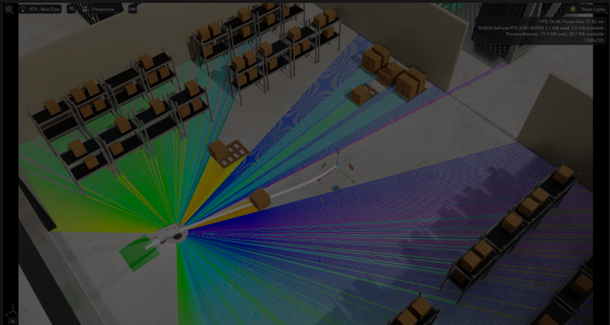
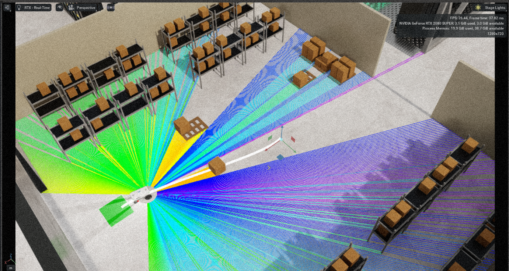
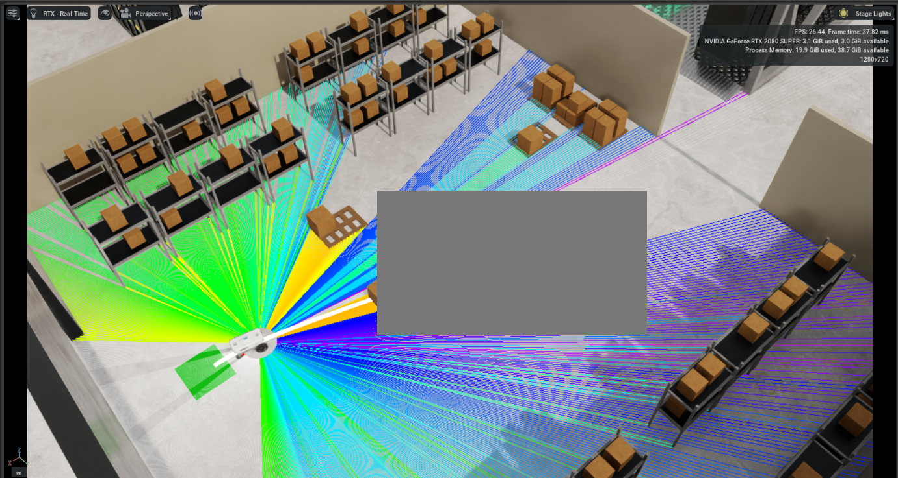
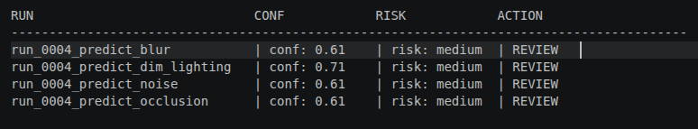

# Project 08 — Cosmos-Ready Digital Twin Evaluation Pipeline

## Overview

This project demonstrates a digital twin evaluation pipeline built around Isaac Sim-style data capture, structured run artifacts, and a Cosmos-ready architecture.

The goal is NOT to fake Cosmos access.

The goal is to prove:
- you understand the real pipeline
- you built it correctly
- you are ready to plug into Cosmos the moment it becomes available

---

## Why This Project Matters

In real physical AI systems, the challenge is NOT just generating outputs.

It is:

- ingesting simulator data correctly
- preserving telemetry context
- evaluating perception robustness
- structuring AI requests and responses
- making downstream decisions

This project solves that pipeline problem.

---

## Architecture

Isaac Sim-style capture  
→ import_isaac_capture.py  
→ structured run bundle  

→ build_cosmos_request.py  
→ parse_cosmos_response.py  

→ mock mode (current)  
→ real Cosmos mode (future-ready scaffold)  

→ decision artifact  
→ evaluation report  
→ comparison across runs  

---

## Predict Simulation Flow

baseline run  
→ simulate_predict_output.py  
→ transformed scenario runs  

→ request / reasoning / decision pipeline  
→ comparison output  

---

## What Is Real vs Simulated

### Real / Implemented

- Isaac-style frame import  
- telemetry ingestion  
- structured run packaging  
- Cosmos request generation  
- response normalization  
- decision logic  
- comparison reporting  
- endpoint scaffolding  

### Simulated

- Cosmos Predict outputs (no public API yet)  
- Cosmos Reason executed in mock mode  

The architecture is REAL.  
Only the model call is simulated.

## Key Runs

### Baseline

- `run_0004`
- imported Isaac-style frames and telemetry
- used as evaluation baseline

---

### Simulated Predict Outputs

- `run_0004_predict_blur`
- `run_0004_predict_dim_lighting`
- `run_0004_predict_noise`
- `run_0004_predict_occlusion`

These runs simulate degraded perception conditions that would normally be handled by Cosmos Predict.

---

## Visual Results

### Blur Scenario


---

### Dim Lighting Scenario


---

### Noise Scenario


---

### Occlusion Scenario


---

### Comparison Output



## Results

### Comparison Output

```
run_0004_predict_blur         | conf: 0.61 | risk: medium | REVIEW | send_to_review_queue
run_0004_predict_dim_lighting | conf: 0.71 | risk: medium | REVIEW | send_to_review_queue
run_0004_predict_noise        | conf: 0.61 | risk: medium | REVIEW | send_to_review_queue
run_0004_predict_occlusion    | conf: 0.61 | risk: medium | REVIEW | send_to_review_queue
```

---


### Interpretation

- baseline run remains strongest
- degraded conditions reduce confidence
- all degraded runs are flagged for review
- no unsafe automatic decisions are made

This mirrors how real perception validation pipelines behave in production systems.

---

## Example Artifacts

Each run produces structured outputs:

- `frames/`
- `video/video.mp4`
- `telemetry/telemetry.json`
- `manifests/run_manifest.json`
- `requests/cosmos_request.json`
- `responses/cosmos_response.json`
- `decisions/decision.json`
- `reports/evaluation_report.md`

---
